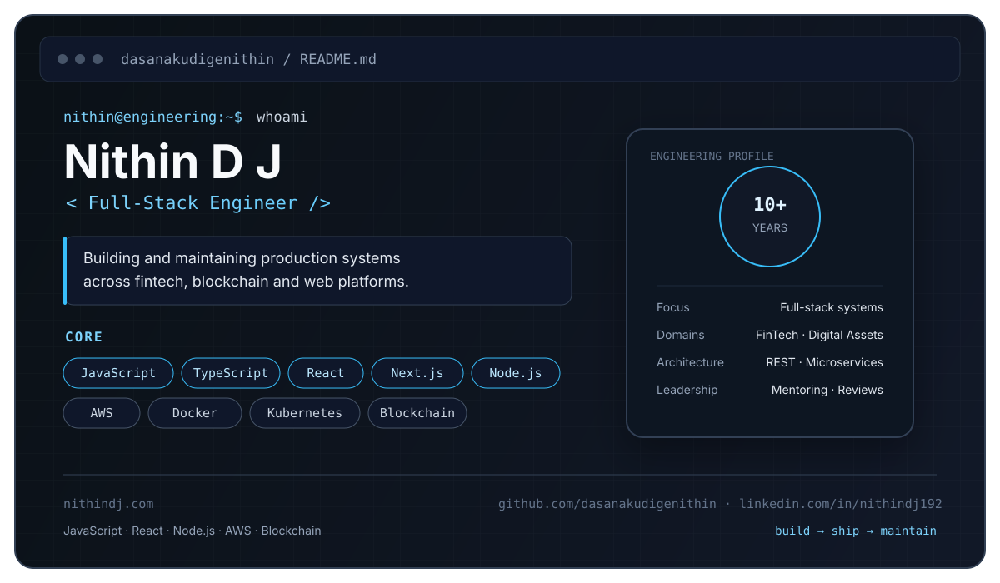

  

  <a href="https://nithindj.com">Portfolio</a> ·
  <a href="https://github.com/dasanakudigenithin">GitHub</a> ·
  <a href="https://www.linkedin.com/in/nithindj192/">LinkedIn</a> .
  <a href="mailto:nithindj192@gmail.com">Email</a>

## About

I'm a full-stack engineer with 10+ years of experience working across fintech, blockchain, and web platforms.

My work spans frontend, backend, cloud infrastructure, and production systems. I've worked on authentication and access control, KYC/KYB, blockchain integrations, platform migrations, and reusable backend components.

Currently, I work as a Senior Software Engineer, contributing to product development, architecture, code reviews, stakeholder communication, and team mentoring.

## What I work with

**Languages & Frameworks**

JavaScript · TypeScript · Node.js · React · Next.js

**Architecture**

REST · Microservices · Event-driven systems

**Cloud & DevOps**

AWS · Docker · Kubernetes · Jenkins · CI/CD

**Blockchain**

Solidity · Smart Contracts · Web3.js · Ethers.js

## Experience

### Clearing (Fortris) — Senior Software Engineer

**October 2021 – Present**

- Lead development across web and mobile product initiatives.
- Designed user management and role-based access using AWS Cognito.
- Worked on DeFi functionality and blockchain wallet integration.
- Contributed to migration from Rails to Next.js/React.
- Work closely with stakeholders on product roadmaps, compliance, optimization, and production support.
- Mentor engineers and help standardize code review and documentation practices.

### Tallyx Labs Pvt Ltd — Senior Software Engineer

**April 2018 – September 2021**

- Designed and developed KYC/KYB, authentication, and notification modules for a B2B trade finance platform.
- Developed reusable Node.js middleware for logging, database access, and file integration.
- Contributed to the ERC1513 token standard.
- Worked with the CTO on architecture and design reviews.
- Mentored junior engineers and helped establish CI/CD practices.

### Tata Consultancy Services — System Engineer

**November 2017 – March 2018**

- Built a chatbot proof of concept using RASA NLU, Python, REST, HTML, and CSS.

### Tata Consultancy Services — System Engineer

**October 2015 – October 2017**

- Developed information-editing features for airport display systems using Java, JSP, and J2EE.
- Built web-based flight information displays using Java, J2EE, JavaScript, and Flash.
- Implemented RESTful services for real-time flight data access.
